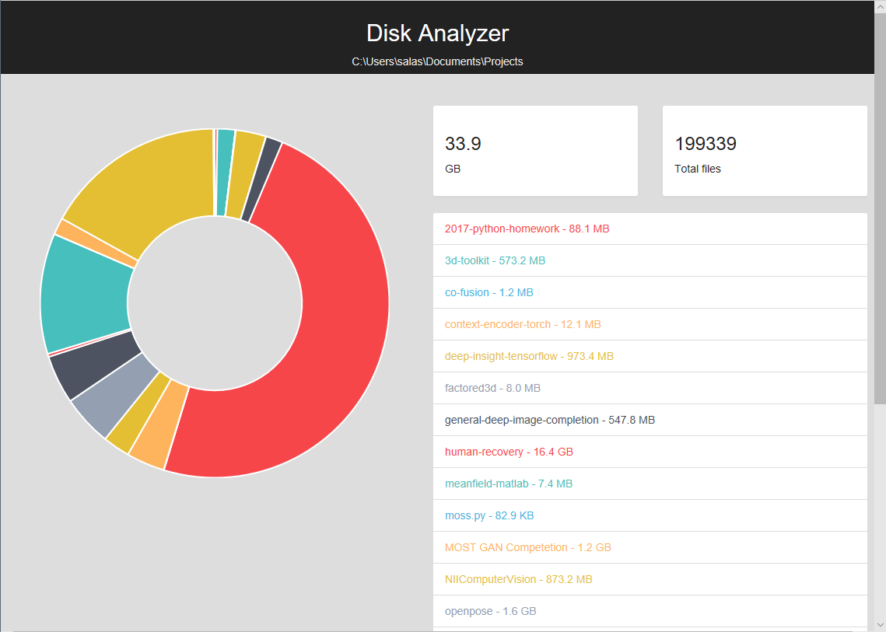

# DiskAnalyzeReporter

Make a report of the specific directory for the disk usage.



## Install

```python
python setup.py install
```

## Usage


- From anywhere `cli` command

```bash
$ da
> /home/salas/Desktop

```

- `Depecrated`

```python
python DiskSizeAnalyze.py {folder_path}
```
